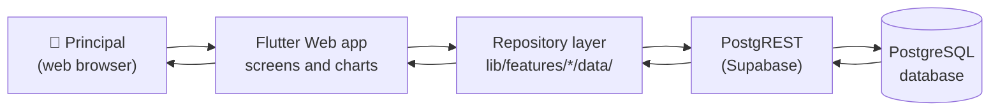

# KSRCE Principal Portal — Complete System Documentation

**Written for:** the Principal, college management, a project manager, and a
developer joining tomorrow morning.

**Verified against the code and the live database on 10 August 2026.**
Every number, table name and route in these documents was checked. Nothing here
is assumed.

---

## Read this first: two things that will surprise you

Most college systems are built in three parts — a screen, a server, and a
database. **This one has two.** If you go looking for the server you will not
find it, and you will waste a day. So, plainly:

### 1. There is no backend server

There is no `Dockerfile`, no `server/` folder, no `backend/` folder, no API
code written by this project. The whole application is **nine packages** and a
database.

The screen talks **straight to the database** over the internet, through a
piece of Supabase called PostgREST.

> **Explain Like I'm 5**
>
> Normally: you ask a waiter, the waiter goes to the kitchen, the kitchen cooks,
> the waiter brings it back. The waiter is the "backend".
>
> Here: **there is no waiter.** You walk up to the kitchen hatch and ask the
> kitchen directly. It is faster, and there is less to build — but it also means
> nobody is standing between you and the kitchen checking that you are allowed
> to be there. That matters, and we come back to it below.

### 2. There is no login

There is no login page. No username, no password, no session. Anyone who opens
the web address **is** the Principal, as far as the software is concerned.

The Principal's own profile is stored against the fixed text
`'placeholder-principal'`, because there is no real user to attach it to yet.

> **Explain Like I'm 5**
>
> The office door has no lock and no name on it. Whoever walks in sits in the
> Principal's chair.

**This is fine for a demonstration. It is not safe for real use.** See
[15-SECURITY.md](15-SECURITY.md), which records a real test we ran where a
student's marks were changed using nothing but the public web address.

---

## What is this system?

**KSRCE ERP** is the college's set of computer systems. There are several
portals — one for students, one for faculty, one for heads of department, and
this one for the Principal.

**The Principal Portal** is the control room. It gathers what the other portals
record — students, staff, attendance, marks, placements — and shows it in one
place so the Principal can see how the whole college is doing without ringing
around twelve departments.

> **Explain Like I'm 5**
>
> Imagine a big school. Every classroom writes down who came in and what marks
> they got. The Principal cannot walk into every classroom every day. So all
> those notes are copied onto one big board in the Principal's room. This portal
> is that board.

## Why does it exist?

A Principal has to answer questions like:

- Which department has poor attendance this week?
- Which subjects are failing too many students?
- How are placements going, and what is the best and worst offer?
- Which students are at risk of falling behind?
- How many staff were in today?

Before this, each answer meant a phone call or a spreadsheet from someone else.
The portal puts them on one screen.

## Who uses it?

**One person: the Principal.** There is only one role, and — see above — it is
not enforced by the software. Details in [02-USER-ROLES.md](02-USER-ROLES.md).

## What can the Principal do?

**Can do today**

- See the whole college on one dashboard
- Narrow everything to one department, programme, batch, year or semester, and
  have that choice follow them from screen to screen
- Read results by department and by subject
- See attendance by department, by year of study, and per student
- See who is present, absent or on leave among the staff
- See placements, including the highest and lowest offer with the student and
  company named
- Approve or reject leave and other requests
- Publish circulars, schedule meetings, record documents
- **Download the roll, the staff list, or placements as a spreadsheet file**

**Cannot do today**

- Log in (there is nothing to log in to)
- Download a PDF — every export is a CSV
- See a real SGPA (the marks needed to calculate one have not been entered)

The honest gap list is in
[17-CURRENT-VS-EXPECTED.md](17-CURRENT-VS-EXPECTED.md).

## Where does the data come from?

Two kinds of place.

**1. The other portals' own records — read only.** The Principal Portal never
changes these. They belong to the Student, Faculty and HOD teams.

| Where | What it holds | Rows today |
|---|---|---|
| `student.students` | the student roll | **10** |
| `student.attendance_table` | daily attendance registers | 47 |
| `faculty.faculties` | the staff list | 16 |
| `faculty.marks` | internal assessment marks | 18 |
| `faculty.leave_applications` | leave requests | 10 |

**2. The Principal Portal's own records** — 62 tables in a space called
`principal`, holding the things nobody else records: approvals, circulars,
meetings, accreditation, finance, placements, the staff attendance register.

> ⚠️ **The roll is nearly empty.** There are **10 students** across **12
> departments**, and 10 of those departments have nobody at all. The portal
> works correctly; it simply has very little to show. When you see `0.0%` or
> `—`, that is usually an honest empty, not a bug.

## How does it all fit together?



Reading it left to right: the Principal clicks something, the app asks its own
repository layer, the repository makes one web request to PostgREST, PostgREST
reads Postgres, and the answer comes back the same way.

**There is no box in the middle that we wrote.** That is the whole point of the
first finding above.

## How do I run it?

The app needs two secrets at build time. They are **not** stored in the repo.

```
flutter run -d chrome \
  --dart-define=SUPABASE_URL=<the project url> \
  --dart-define=SUPABASE_ANON_KEY=<the public key>
```

`run-live.bat` in the project root does this for you. That file holds the key,
which is why it is listed in `.gitignore` and never committed.

Without those two values the app still starts, but every screen shows an error
box instead of data — deliberately. See
[09-ERROR-STATES.md](09-ERROR-STATES.md) for why.

## Where is everything?

```
principal-portal/
├── lib/
│   ├── core/          shared: theme, routing, filters, search, base classes
│   └── features/      one folder per screen area, 22 screens
│       └── <area>/
│           ├── screens/     the page itself
│           ├── widgets/     cards, charts, tables on that page
│           ├── providers/   what the page reads (state)
│           ├── data/        the database calls (repository)
│           └── models/      the shapes the data takes
├── supabase/
│   ├── migrations/    20 files — every change ever made to the database
│   └── seed.sql       the sample data
├── test/              79 tests
└── docs/              you are here
```

## The document set

| # | Document | Answers |
|---|---|---|
| 00 | **README** (this) | What is it? Why? Who? How do I start? |
| 01 | [System Overview](01-SYSTEM-OVERVIEW.md) | How is it built? How does data move? |
| 02 | [User Roles](02-USER-ROLES.md) | Who can do what? |
| 03 | [Page Inventory](03-PAGE-INVENTORY.md) | What screens exist? |

> **Digital Repository and Settings have been removed** from the portal.
> Documents written before that still describe them; the page inventory is
> the current list.
| 04 | [Page by Page](04-PAGE-BY-PAGE.md) | What does every card, chart and button do? |
| 06 | [Database](06-DATABASE.md) | What is stored, and where? |
| 07 | [Database Relationships](07-DATABASE-RELATIONSHIPS.md) | How do the tables connect? |
| 08 | [Data Access](08-DATA-ACCESS.md) | Which screen reads which table? |
| 09 | [Error & Empty States](09-ERROR-STATES.md) | What happens when it goes wrong? |
| 12 | [Data Flows](12-DATA-FLOWS.md) | The full journey, step by step |
| 13 | [Filter System](13-FILTER-SYSTEM.md) | How do the dropdowns work? |
| 14 | [Business Logic](14-BUSINESS-LOGIC.md) | Where does every number come from? |
| 15 | [Security](15-SECURITY.md) | ⚠️ Read before deploying |
| 16 | [Requirements](16-REQUIREMENTS.md) | What must it do? |
| 17 | [Current vs Expected](17-CURRENT-VS-EXPECTED.md) | What is missing or broken? |
| 18 | [Glossary](18-GLOSSARY.md) | What does that word mean? |
| 19 | [Feature Matrix](19-COMPLETE-FEATURE-MATRIX.md) | Everything, in one table |

## One-page summary

| | |
|---|---|
| **Name** | KSRCE ERP — Principal Portal |
| **Type** | Single-page web application |
| **Screen** | Flutter Web (Dart), Material 3 |
| **Server** | **NOT FOUND** — none exists; the browser calls the database directly |
| **Database** | PostgreSQL, hosted by Supabase |
| **Data access** | PostgREST, via the `supabase_flutter` package |
| **Login** | **NOT FOUND** — no authentication |
| **Permissions** | **NOT FOUND** — no authorization |
| **State** | Riverpod |
| **Routing** | go_router, 20 routes in a persistent shell |
| **Charts** | fl_chart |
| **Tables** | data_table_2 |
| **Size** | 302 Dart files, ~31,000 lines |
| **Screens** | 20 |
| **Own tables** | 62 in `principal`, plus 7 views |
| **Read-only sources** | `student`, `faculty`, `hod`, `public` schemas |
| **Tests** | 114, all passing |
| **Static analysis** | 0 issues |
| **Biggest risk** | ⚠️ No login, and the public key can edit student marks |
