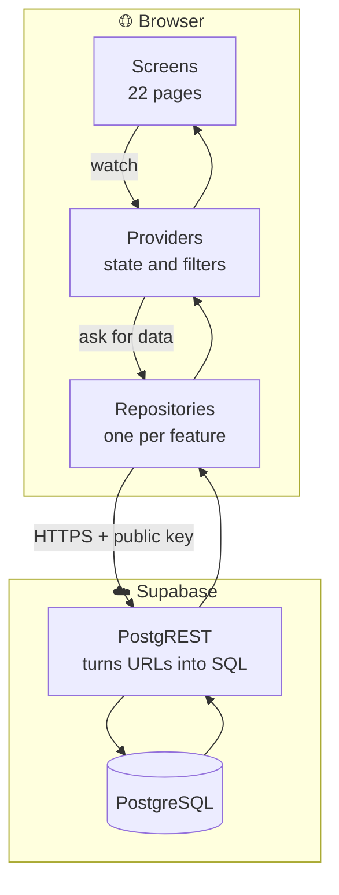
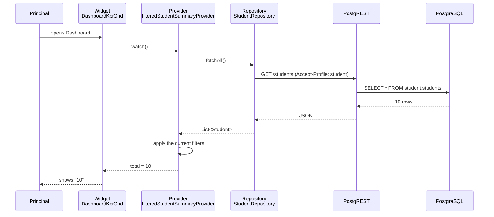

# 01 — System Overview

How the Principal Portal is built, and how a number gets from the database onto
the screen.

---

## 1. What the system is made of

| Layer | Technology | Where it lives |
|---|---|---|
| Screen | Flutter Web (Dart), Material 3 | `lib/features/*/screens/`, `lib/features/*/widgets/` |
| State | Riverpod | `lib/features/*/providers/`, `lib/core/filters/` |
| Data access | `supabase_flutter` → PostgREST | `lib/features/*/data/*_repository.dart` |
| Shared base | `Repository` class | `lib/core/services/repository.dart` |
| Connection | `SupabaseService` | `lib/core/services/supabase_service.dart` |
| Database | PostgreSQL (Supabase) | `supabase/migrations/` |
| Routing | go_router | `lib/core/router/` |
| Charts | fl_chart | `lib/core/widgets/charts/` |

**The complete dependency list is nine packages** — `flutter`,
`flutter_riverpod`, `go_router`, `fl_chart`, `google_fonts`, `intl`,
`collection`, `supabase_flutter`, `web`. If you are looking for a web framework,
an ORM or an HTTP server, there isn't one.

## 2. The layers, explained simply

**Frontend** — what you see and click. Buttons, charts, tables.

**Backend** — normally the hidden worker between the screen and the database.
**In this project it does not exist.** Its jobs are done in two other places:

- *Shaping and combining data* → done by **database views** (see §5)
- *Filtering and calculating* → done by **Riverpod providers** in the app

**Database** — a big cupboard where information is stored.
**Table** — one box in the cupboard holding one kind of thing (a box for
students, a box for meetings).
**View** — a box that is really a **recipe**: it does not store anything, it
works out its contents fresh from other boxes every time you open it.

> **Explain Like I'm 5**
>
> A **table** is a drawer with socks in it. You open it, the socks are there.
>
> A **view** is a note taped to the wall saying "count the socks in drawer 1 and
> drawer 2 and add them up". Every time you read the note you get today's
> answer, never yesterday's. That is why we use views for totals — a total we
> wrote down once would go stale, and nobody would notice.

## 3. High-level architecture



**Note what is absent:** there is no application server between the browser and
Supabase. The public key travels from the browser with every request.

## 4. How a number reaches the screen

Take "Total Students: 10" on the Dashboard.



Two things worth noticing:

1. **The filter is applied in the browser, not the database.** The whole roll is
   fetched, then narrowed. That is fine at 10 students; it would need revisiting
   at 10,000.
2. **Nothing in that chain checks who the user is.** There is no step where
   permission is tested, because there is no login.

## 5. Where the business rules actually live

With no server, rules live in two places. Knowing which is which saves hours.

**In the database, as views** — anything that combines tables or produces a
total:

| View | What it works out | Rows |
|---|---|---|
| `v_department_rollup` | per department: students, staff, attendance, pass %, placement %, rank | 12 |
| `v_dashboard_summary` | every headline dashboard figure, in one row | 1 |
| `v_attendance_daily` | average attendance per day, whole college | 15 |
| `v_attendance_daily_by_department` | the same, split by department | 15 |
| `v_faculty_attendance_today` | present / absent / on leave per department | 2 |
| `v_department_placement_summary` | offers vs roll per department | 12 |
| `v_package_bands` | offers grouped into salary bands | 5 |

**In the app, as providers** — anything that responds to a filter or is only
about display: the filtered roll, the summary cards, the programme-level split,
the pass summary. See [14-BUSINESS-LOGIC.md](14-BUSINESS-LOGIC.md).

> **Explain Like I'm 5**
>
> The database does the sums that are always true ("how many students are in
> CSE?").
>
> The app does the sums that depend on what you just clicked ("…and only the
> third years, and only the ones at risk").

## 6. The repository layer — the closest thing to a backend

Every feature has one file at `lib/features/<area>/data/<area>_repository.dart`.
They all extend `Repository` (`lib/core/services/repository.dart`), which gives
them one method:

```dart
Future<Sourced<T>> load<T>({
  required Future<T> Function() fromSupabase,
  T Function()? sample,
  bool Function(T)? isEmpty,
  String debugLabel = '',
})
```

`Sourced<T>` is the value plus where it came from (live or sample) — that is
what powers the green "Live data" badge you see on some screens.

**Important behaviour:** `sample` is now always absent. When there is no
database connection, `load` **throws**, and the screen shows an error box.

That is deliberate. Earlier it fell back to realistic-looking sample figures,
which meant a Principal could read a number off the screen with no way of
telling it was fiction. An error is honest; a plausible wrong number is not.

## 7. Talking to more than one schema

A **schema** is a section of the database — like a shelf in the cupboard. This
system has five, and the portal's rights differ per shelf:

| Schema | Owner | Portal's rights |
|---|---|---|
| `principal` | this portal | read **and** write |
| `student` | Student Portal | **read only** |
| `faculty` | Faculty Portal | read only, **one exception** ¹ |
| `hod` | HOD Portal | read only |
| `public` | shared | read only |

¹ The single exception: approving leave writes `status` on
`faculty.leave_applications`. That changes a row, never the table's shape. The
full record of who decided and why is written to
`principal.approval_decisions`, so the Faculty Portal's structure is untouched.

`SupabaseService.schema('student')` picks the shelf. Behind the scenes that sets
the `Accept-Profile` header PostgREST reads.

## 8. Routing and the shell

`go_router` with `StatefulShellRoute.indexedStack`. In plain terms: the sidebar
and top bar are drawn **once** and stay put; only the middle changes when you
click a nav item. Each of the 22 routes keeps its own scroll position and
selected tab, so going away and coming back returns you where you were.

## 9. Configuration

`AppConfig` reads two values given at build time:

- `SUPABASE_URL`
- `SUPABASE_ANON_KEY`

Both are supplied with `--dart-define`. **Neither is committed.** The key is
public by design — it is meant to be safe to ship in a browser, *provided the
database enforces row-level security*. It currently does not, which is the
finding in [15-SECURITY.md](15-SECURITY.md).

## 10. What is NOT in this system

Recorded so nobody spends a morning searching:

| Thing | Status |
|---|---|
| Backend server / API code | **NOT FOUND** |
| Docker / docker-compose | **NOT FOUND** |
| Supabase Edge Functions | **NOT FOUND** |
| Login / authentication | **NOT FOUND** |
| Roles / permissions | **NOT FOUND** |
| ORM | **NOT FOUND** — PostgREST is called directly |
| File upload / storage | **NOT FOUND** — the repository stores *details about* documents, never a file |
| PDF or report generation | **NOT FOUND** — every export is a CSV, written in the browser |
| Caching layer | **NOT FOUND** — Riverpod holds results for the session only |
| CI / CD pipeline | **NOT FOUND** |

---

**Next:** [03-PAGE-INVENTORY.md](03-PAGE-INVENTORY.md) — every screen, its
route, its tabs, and what it reads.
