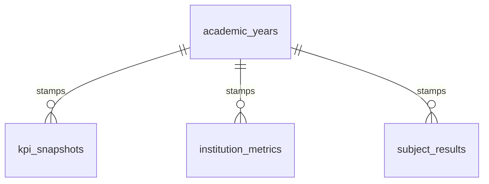
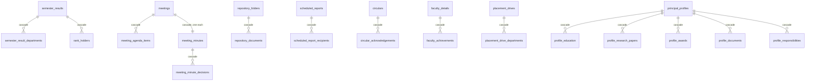
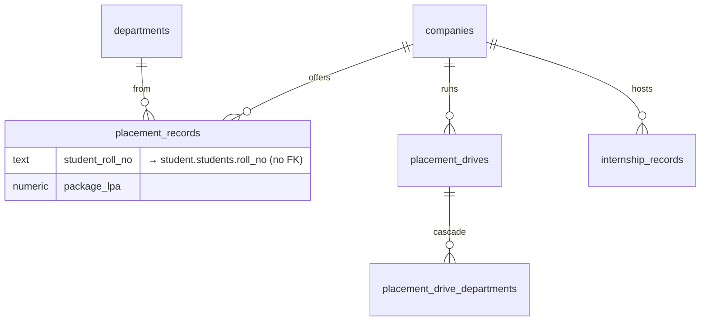

# 07 — Database Relationships

How the tables connect. Every relationship below was read from the actual
`references` clauses in `supabase/migrations/`.

---

## What a relationship is

> **Explain Like I'm 5**
>
> You have a box of students and a box of departments.
>
> Instead of writing "Computer Science & Engineering" on every single student
> card — and spelling it differently half the time — each student card just says
> **"department #7"**. Box of departments, card 7, says what #7 is.
>
> That pointer is a **foreign key**.
>
> **One-to-many:** one department has many students. One meeting has many agenda
> items.
>
> **`on delete restrict`** means: *you may not throw away department #7 while
> students still point at it.* The database refuses. That is a safety net, not
> an inconvenience.
>
> **`on delete cascade`** means: *throw away the meeting and its agenda items go
> too* — because an agenda item has no meaning without its meeting.

---

## The two hubs

Almost everything hangs off one of two tables.

### `principal.departments` — the main hub

**16 tables point at it.** It is the spine of the whole schema.

```mermaid
erDiagram
    departments ||--o{ subject_results : "has"
    departments ||--o{ semester_result_departments : "split by"
    departments ||--o{ rank_holders : "from"
    departments ||--|| department_admin_metrics : "one each"
    departments ||--o{ exam_schedules : "sits"
    departments ||--|| cia_progress : "one each"
    departments ||--|| hall_ticket_status : "one each"
    departments ||--o{ program_accreditations : "accredits"
    departments ||--|| department_fee_status : "one each"
    departments ||--o{ placement_records : "places"
    departments ||--o{ placement_drive_departments : "targets"
    departments ||--o{ internship_records : "hosts"
    departments ||--o{ approval_requests : "raises"
    departments ||--o{ funded_projects : "runs"
    departments ||--o{ consultancy_projects : "runs"
    departments ||--o{ student_achievements : "credits"
```



Four of those are marked `unique` — **exactly one row per department**:
`department_admin_metrics`, `cia_progress`, `hall_ticket_status`,
`department_fee_status`. A department cannot accidentally end up with two budget
records.

All department links use **`on delete restrict`**. A department with any history
attached cannot be deleted.

### `principal.academic_years` — the second hub



These use **`on delete set null`**, not `restrict`. Deleting an academic year
leaves the figures in place with no year attached, rather than blocking the
delete or destroying the data. A figure without a year is still a figure.

---

## The parent–child groups

These are the `cascade` relationships: the child cannot exist without its
parent.



> **Explain Like I'm 5**
>
> Delete the meeting, and its agenda goes with it. An agenda for a meeting that
> does not exist is rubbish, and leaving rubbish behind is how a database slowly
> fills with things nobody can explain.

**`principal_profiles` has exactly five child tables** — `profile_education`,
`profile_research_papers`, `profile_awards`, `profile_documents`,
`profile_responsibilities` — all cascading. Deleting the profile removes
everything attached to it.

**`report_runs` does *not* cascade from `scheduled_reports`.** A run is a record
that a report was requested; it survives the schedule being deleted.

---

## Placements



`placement_records` points at **both** a company and a department, both with
`restrict`. You cannot delete a company that has made an offer.

Its unique key is `(student_roll_no, company_id)` — one student, one offer per
company. Re-running the seed cannot double the table.

---

## Cross-schema links — the important part

The Principal Portal links to the Student, Faculty and HOD schemas. **Those
links are text, never real foreign keys.**

| From | Column | Points at | FK? |
|---|---|---|---|
| `principal.faculty_details` | `employee_id` | `faculty.faculties.employee_id` | **No** |
| `principal.faculty_attendance` | `faculty_employee_id` | `faculty.faculties.employee_id` | **No** |
| `principal.subject_results` | `faculty_employee_id` | `faculty.faculties.employee_id` | **No** |
| `principal.placement_records` | `student_roll_no` | `student.students.roll_no` | **No** |
| `principal.rank_holders` | `student_roll_no` | `student.students.roll_no` | **No** |
| `principal.approval_decisions` | `source_id` (text) | a leave row in `faculty` | **No** |

### Why no foreign keys?

Stated directly in migration 17:

> *"Deliberately no foreign key: a cross-schema FK would require a unique
> constraint on their table, which is a structural change to a table this portal
> only reads."*

And on `approval_decisions`:

> *"`source_id` is text, not a uuid FK, because it points at a row in another
> schema that we deliberately do not couple to."*

> **Explain Like I'm 5**
>
> A foreign key is a **handcuff** between two tables. Handcuffing our table to
> theirs would mean changing *their* table to make the handcuff fit — and their
> table belongs to another team.
>
> So instead of a handcuff we write the employee number on a note. It works the
> same way, and nobody else's table has to change.
>
> **The trade-off is real:** the database will not stop us writing an employee
> number that does not exist. Nothing enforces it. That is the price of not
> touching another team's tables, and it was paid knowingly.

---

## A bug this caused, and how it was fixed

`faculty_attendance.faculty_employee_id` and
`research_publications.faculty_employee_id` both join on **`employee_id`**.

The faculty repository was reading the row's **uuid** into its `id` field
instead. Nothing crashed. Nothing was flagged. Both joins simply matched
**nothing**, silently, and the screens showed empty tables.

The fix, from `faculty_repository.dart`:

```dart
// employee_id first, not the uuid. It is the identifier a Principal
// recognises on an exported report, and it is the key every other
// table joins on.
final id = row.firstStr(['employee_id', 'faculty_id', 'id']) ?? '';
```

This is exactly the failure mode a foreign key would have caught. Without one,
the check has to be made by hand.

---

## Where relationships are *not* enforced at all

| Relationship | How it is matched |
|---|---|
| `principal.departments` ↔ `student.students.department` | **text pattern matching** — `upper(dept) like '%' \|\| d.code \|\| '%'` |
| `principal.departments` ↔ `faculty.faculties.department` | same |
| `principal.departments` ↔ `student.attendance_table.dept` | same |
| `principal.departments` ↔ `hod.hod_departments` | **not linked** — `hod_departments` holds **0 rows** |

The source tables store departments as **free text spelt several ways**, so
matching is by the code found inside the string. The Dart equivalent is
`DepartmentNormalizer.codeFor()`.

Both use `left join`, so a department with nobody in it returns 0 rather than
disappearing from the list.

> ⚠️ **`hod.hod_departments` is empty.** That is why `principal.departments`
> exists as its own master list of 12. If the HOD team populates theirs, the two
> lists will need reconciling. The risk is recorded in migration 01.

---

## Referential rules, summarised

| Rule | Where used | Meaning |
|---|---|---|
| `on delete restrict` | every `department_id`, every `company_id` | Cannot delete a parent that still has children. Protects history. |
| `on delete cascade` | meetings, minutes, folders, profiles, circulars, drives | Delete the parent and the children go too. They have no meaning alone. |
| `on delete set null` | every `academic_year_id` | Delete the year; the figures stay, unstamped. |
| `unique` | 4 per-department tables, `meeting_minutes.meeting_id` | Exactly one row per parent. |
| *no constraint* | every cross-schema link | Deliberate — see above. |

---

## Every table has three columns

Without exception:

```sql
id         uuid primary key default gen_random_uuid(),
created_at timestamptz not null default now(),
updated_at timestamptz not null default now()
```

`updated_at` is maintained by one shared trigger function,
`principal.set_updated_at()`, applied by `principal.apply_standard_setup(table)`
along with the RLS policies. **62 tables, one implementation.**

---

## Natural keys — why the seed is safe to re-run

Migration 12 added unique constraints on the *business* identity of a row, not
just its uuid:

| Table | Natural key |
|---|---|
| `placement_records` | `(student_roll_no, company_id)` |
| `faculty_attendance` | `(faculty_employee_id, attendance_date)` |
| …and others across the schema | |

> **Explain Like I'm 5**
>
> Without these, running the sample-data script twice gives every student **two**
> job offers and every teacher **two** attendance marks for the same day. Every
> total doubles, and nothing warns you.
>
> The natural key means the second run replaces rather than repeats.

---

**Next:** [08-DATA-ACCESS.md](08-DATA-ACCESS.md) — which screen reads which
table.
