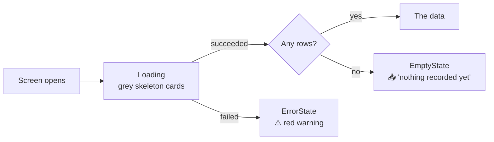

# 09 — Error, Loading and Empty States

What the Principal sees when something is slow, broken, or simply not there
yet — and why those three are kept strictly apart.

---

## The three states

Every screen that loads data has exactly three outcomes.



| State | Widget | Looks like |
|---|---|---|
| Loading | `LoadingSkeleton` / `CardSkeleton` | grey placeholder cards the shape of the real ones |
| Error | `ErrorState` | a red warning icon, a message, and an optional **Retry** |
| Empty | `EmptyState` | a grey inbox icon and a plain sentence |

> **Explain Like I'm 5**
>
> **Loading** — "wait a moment, I'm fetching it."
> **Error** — "I tried and couldn't. Something is wrong."
> **Empty** — "I looked. There is genuinely nothing there."
>
> Those are three different things and a Principal must be able to tell them
> apart. "No students in Civil" is a fact. "I couldn't reach the database" is a
> fault. Showing the same grey box for both would hide the fault.

---

## The rule that matters most: no invented data

`Repository.load()` used to fall back to sample figures whenever the database
could not be reached. The comment in the code now says why it does not:

> *"Quietly serving representative figures when the database is unreachable
> means a Principal can read a number off the screen with no way of telling it
> is fiction. An error says plainly that the data could not be loaded."*

So:

```dart
if (!SupabaseService.isReady) {
  if (sample == null) {
    throw StateError(
      'No database connection$…. This screen has no offline data to fall back to.',
    );
  }
  …
}
```

**`sample` is now always absent.** All 27 mock-data files were deleted. With no
connection, `load()` throws, and the screen shows its error box.

**Run the app without `--dart-define` and every screen shows an error.** That is
correct behaviour, not a bug.

### The `DataSource` badge

`Repository.load()` returns a `Sourced<T>` — the value plus where it came from
(`live` or `sample`). That is what drives the green **"Live data"** badge in the
header of several screens.

Since sample data no longer exists, the badge now only ever confirms live data.
The mechanism is kept because it costs nothing and would be needed again the
moment any offline mode returns.

---

## Writes fail loudly, always

Reads may degrade. **Writes may not.**

> *"A failure is rethrown rather than swallowed: a read can fall back to sample
> data honestly, but a write that silently did nothing would leave the user
> believing they had saved something."*

Every write first calls `_requireConnection()`, which throws with a plain
message. A Principal who presses **Publish** either publishes or is told it
failed. There is no third outcome.

---

## Partial failure: `gather()`

Some sources are genuinely unreachable — the `hod` schema is not always exposed
to the API. A plain `Future.wait` throws on the **first** failure and discards
the results that *did* come back.

`Repository.gather()` runs each source independently and keeps whatever
succeeds:

```dart
try {
  collected.addAll(await entry.value());
} catch (error) {
  debugPrint('Source unavailable (${entry.key}): $error');
}
```

**Where this matters:** Circulars reads `principal.circulars`,
`hod.department_notices` and `student.notice_board_posts`. If the HOD schema is
unavailable, the Principal still sees their own circulars and the student
notices, rather than an error where three sources should be.

---

## Empty states that were bugs

### The crash — Attendance → Overall

```dart
final latest  = days.last.percent;
final average = days.fold(0.0, (s, d) => s + d.percent) / days.length;
final best    = days.reduce((a, b) => a.percent > b.percent ? a : b);
```

A department with nothing on the register returns an **empty list**. All three
of those throw. In release the whole tab went grey with no message.

Now:

```dart
if (days.isEmpty) {
  return EmptyState(
    message: department == null
        ? 'No attendance has been recorded yet.'
        : 'No attendance recorded for $department.',
  );
}
```

**The message names the department.** "No attendance recorded for CIVIL" tells
the Principal their filter is the reason. A generic "no data" does not.

### The silent one — `.value` vs `.valueOrNull`

About **20 places** read `ref.watch(provider).value ?? const []`.

`AsyncValue.value` **rethrows** the error when a provider has failed.
`valueOrNull` returns `null`. The `?? const []` looked like a safe default but
never ran — the getter threw first.

These were latent because `load()` always fell back to sample data, so nothing
ever failed. Deleting the mock data would have turned every one of them into a
crash. One was in the **sidebar approvals badge**, which is on every screen.

All were changed to `valueOrNull`.

> **Lesson worth keeping:** `.value` on an `AsyncValue` is only safe when you
> have already checked the state. Prefer `valueOrNull` or `.when()`.

---

## Empty states that are correct

Not everything blank is broken. These are honest:

| Screen | Shows nothing | Why that is right |
|---|---|---|
| Research → Patents & IPR | 0 patents | `faculty.patents` has **0 rows** — the institution has filed none |
| Approvals → decisions | no history | `approval_decisions` has 0 rows — no decision has been made |
| Attendance → by year | years missing | years with nobody on the roll are **omitted, not shown as 0%** |
| Department cards | `0.0%` and `—` | 10 of 12 departments have **no students** |
| Audit → Compliance | blank subtitle until loaded | zeros would read as a real "0% compliant" |

### Omitted, not zero

`attendanceByYearProvider` leaves out years with nobody enrolled:

> *"Years with nobody on the roll are left out rather than reported as 0%, which
> would read as terrible attendance instead of no data."*

**0% is a claim. Absence is not.** They must not look the same.

### Null, not zero, for impossible ratios

The database does the same thing:

```sql
case when dam.sanctioned_posts > 0
     then round(dam.filled_posts::numeric / dam.sanctioned_posts * 100, 2) end
```

No `else`, so the result is `null`, which the screen renders as an em dash. A
`0` would claim the department is 0% staffed.

`nullif(count(*), 0)` in `v_faculty_attendance_today` does the same for the
present-percentage.

---

## Averages ignore unrecorded values

`avg(nullif(cgpa, 0))` in SQL, `values.where((v) => v > 0)` in Dart.

Ten students, two with marks (80, 90):

- treating blanks as zero → **17** (looks like a disaster)
- skipping blanks → **85** (the truth about the students we have marks for)

Full explanation in [14-BUSINESS-LOGIC.md](14-BUSINESS-LOGIC.md) §2.

---

## Layout failures that were fixed

Overflow is an error state too — Flutter draws yellow-and-black stripes where
content does not fit.

| Where | Symptom | Cause | Fix |
|---|---|---|---|
| `AppDatePicker` | 13px overflow | a `Row` with no flexible child in a fixed-width box | wrapped the `Text` in `Flexible` with ellipsis |
| `StatisticsCard` trend row | 11px overflow at the larger font | same defect class | same fix |
| Chart bottom axis | `2026 2026 2026` repeated | no `interval: 1` | interval set |
| Chart left axis | `4262` wrapped to `426` / `2` | `reservedSize: 34` too small | wider reserve + a `_compact()` formatter |
| Bar value column | `92.00%` clipped to `92.0…` | column too narrow | widened |

---

## Checklist for a new screen

1. Use `.when(loading:, error:, data:)` — never `.value`.
2. Give `loading` a **skeleton the shape of the real content**, not a spinner —
   the page should not jump when data arrives.
3. Give `error` an `ErrorState`, with `onRetry` where a retry makes sense.
4. **Guard every empty list** before calling `.first`, `.last`, `.reduce`, or
   dividing by `length`.
5. Make the empty message **name the active filter** where one applies.
6. Never substitute a plausible number for a missing one.

---

**Next:** [08-DATA-ACCESS.md](08-DATA-ACCESS.md) — which repository reads what.
