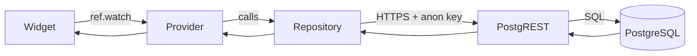
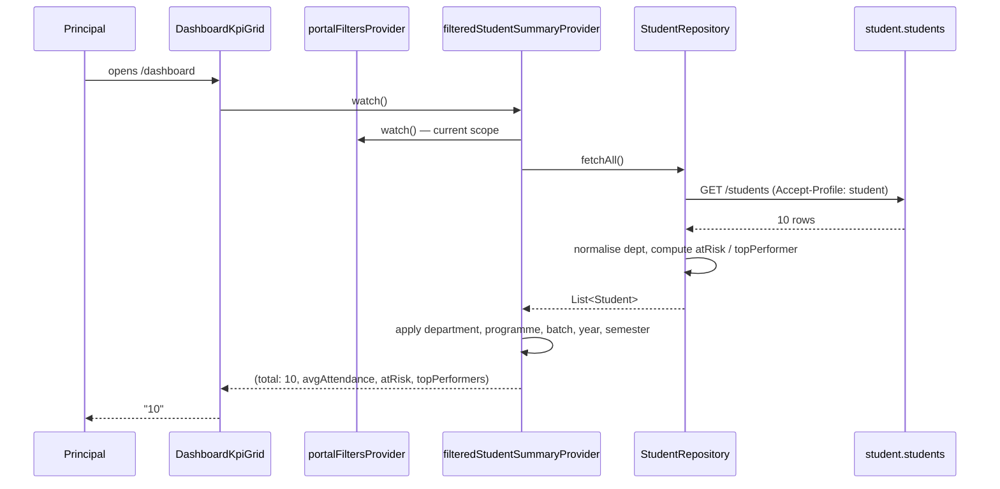
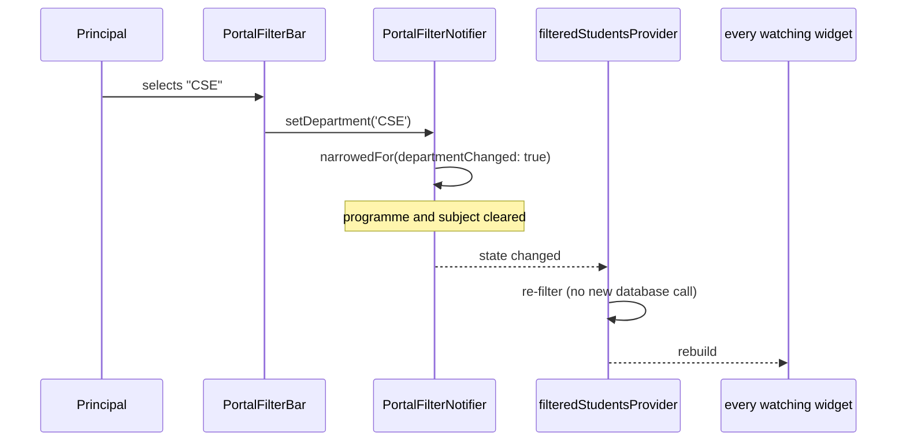
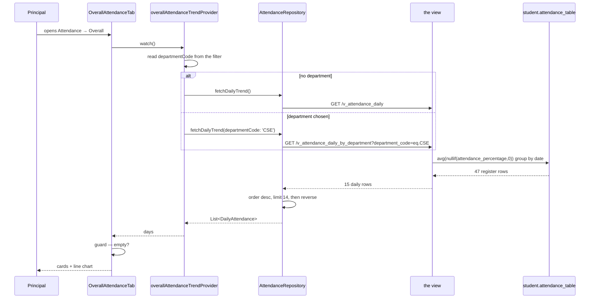
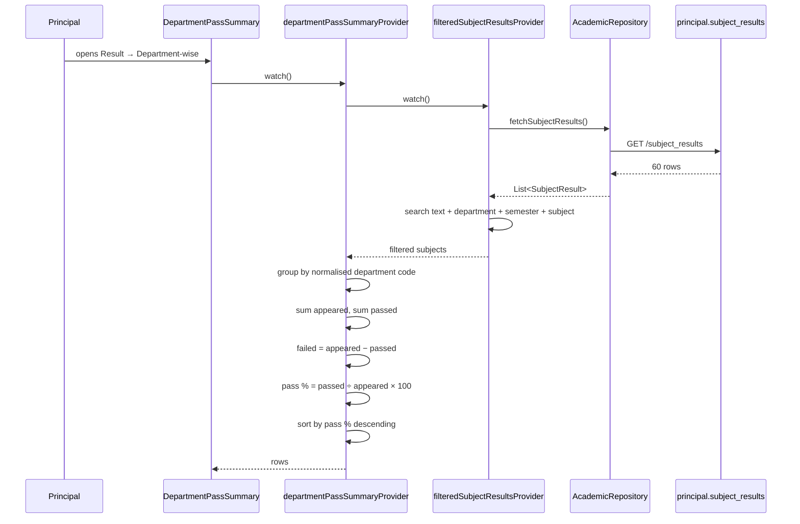
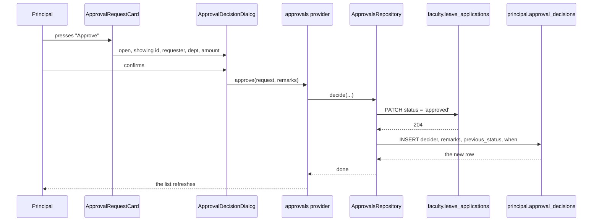
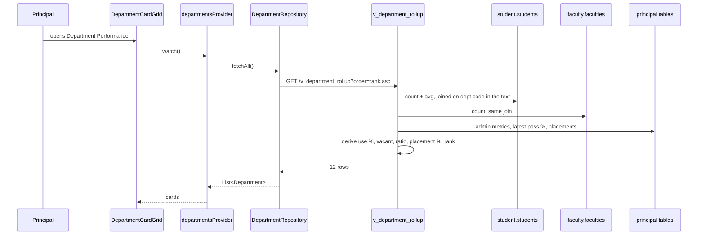

# 12 — Data Flows

The full journey of a number, from a click to the screen, for the six most
important flows.

---

## The shape every flow has



Five steps, every time. **There is no sixth step where a server checks
anything.**

> **Explain Like I'm 5**
>
> The **widget** is the shop window.
> The **provider** is the shop assistant who remembers what you asked for.
> The **repository** is the one person allowed into the warehouse.
> **PostgREST** is the warehouse door.
> The **database** is the warehouse.
>
> Nobody checks your ID at any point.

---

## Flow 1 — Dashboard: "Total Students"



**Two things to notice.**

**The filter is applied in the browser.** The whole roll is fetched, then
narrowed. Fine at 10 students; it needs revisiting at 10,000.

**The flags are computed, not read.** `student.students` carries no
"top performer" or "at risk" column. The repository derives both from the
thresholds in `student_repository.dart:15-17` as each row is converted.

### When the filter changes



**No database call happens.** The roll is already in memory; Riverpod re-runs
the filter and rebuilds everything watching it. That is why narrowing feels
instant.

---

## Flow 2 — Attendance: the trend chart



**The averaging happens in the database, not the browser.** 47 register rows
become 15 daily rows before they cross the network.

**Which view is read is decided at call time**, so the department filter above
the chart genuinely changes what the chart draws. Before
`v_attendance_daily_by_department` existed, four filters sat above a chart that
ignored all of them.

**`limit(14)` then `.reversed`** — newest fourteen days, then flipped so the
chart reads left to right.

**The empty guard is essential.** A department with nothing on the register
returns an empty list, and `days.last`, `days.reduce` and `÷ days.length` all
throw.

---

## Flow 3 — Result: pass % by department



**The chain is deliberate.** The summary reads the *filtered* subject list, not
the raw table — so narrowing to one semester narrows the department summary too.
A summary computed from unfiltered data beside a filtered table is a
contradiction waiting to be noticed.

**Grouping is on `DepartmentNormalizer.codeFor()`**, never the raw text. Without
that, "CSE" and "Computer Science and Engineering" appear as two departments.

**One text-to-number conversion:** `subject_results.semester` stores
`'Semester 5'`; the filter holds `5`. `_semesterNumber()` extracts the digits.
Comparing them directly would silently match nothing.

---

## Flow 4 — Approvals: approving leave *(the only write outside `principal`)*



**Two writes, two schemas, on purpose.**

Their table has `status` and `hod_remarks` but no principal column. So the
**status** goes on their row — the Faculty Portal sees the decision immediately,
and their structure is untouched. The **full record** — who, why, when, and what
the status was before — goes in our schema.

> **Explain Like I'm 5**
>
> Their form has a tick-box for approved/rejected, so we tick it. It has no box
> for "who decided and why", and we may not add one to their form — so we write
> that in our own notebook, with a reference back to their form.

**Writes never fall back.** A failed write is rethrown, because a write that
silently did nothing would leave the Principal believing they had approved
something.

---

## Flow 5 — Placement: highest and lowest offer

```mermaid
sequenceDiagram
    participant U as Principal
    participant W as PlacementSummaryCards
    participant P as package extremes provider
    participant F as portalFiltersProvider
    participant R as PlacementRepository
    participant DB as principal.placement_records

    U->>W: opens Placement → Overview
    W->>P: watch()
    P->>R: fetchRecords()
    R->>DB: GET /placement_records
    DB-->>R: 60 rows
    R->>R: batch = BatchParser(roll number)
    R-->>P: List<PlacementRecord>
    P->>F: read department, batch, programme
    P->>P: filter
    P->>P: empty? → (null, null)
    P->>P: sort by package; take both ends
    P-->>W: highest + lowest, each with student and company
```

**The batch is derived, never stored.** `placement_records` has no batch column;
`BatchParser` reads it from the register number (`22CSE001` → 2022). A derived
batch cannot disagree with the number it came from.

**Both ends are returned.** A dashboard that reports only the highest package
tells the Principal the best story available, not the true one.

**The empty case returns `(null, null)`** rather than throwing on `sorted.first`.

---

## Flow 6 — Department Performance: the rollup



**This is the flow that most justifies the view-based design.** One request
returns twelve rows that already contain live head counts, averages, derived
ratios and a rank — computed across **two other portals' schemas and four of our
own tables.**

Doing this in Dart would mean six requests and a join written in the browser,
re-implemented per screen and free to disagree.

**The join is a text match** — `upper(dept) like '%' || d.code || '%'` — because
the source tables store departments as free text spelt several ways. It is the
SQL twin of `DepartmentNormalizer.codeFor()`.

**Everything derived is derived on read**, so `budget_utilisation_percent` can
never contradict `budget_allocated` and `budget_utilised` sitting beside it.

---

## What every flow has in common

| | |
|---|---|
| Steps from click to database | **5** — widget, provider, repository, PostgREST, Postgres |
| Servers in the middle we wrote | **0** |
| Authentication checks | **0** |
| Caching layers | **0** — Riverpod holds results for the session only |
| Where filters are applied | **the browser**, except attendance-by-department |
| Where totals are calculated | **the database**, as views |
| What happens on failure | an error is shown; **no substitute number is invented** |

---

**Next:** [16-REQUIREMENTS.md](16-REQUIREMENTS.md) — what the system must do.
