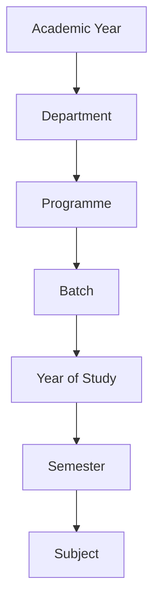
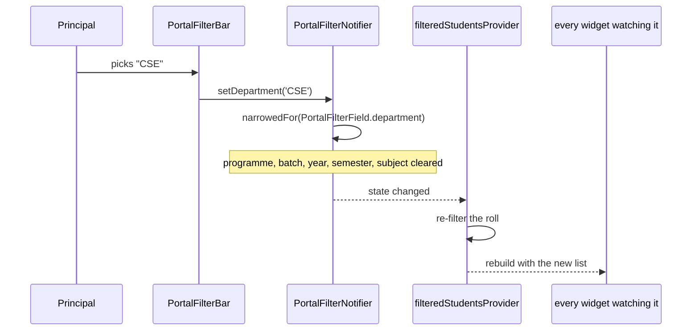

# 13 — The Filter System

How the dropdowns at the top of a screen work, why the choice follows you from
page to page, and why ten screens deliberately have none.

**Source files**
`lib/core/filters/portal_filters.dart` ·
`lib/core/filters/portal_filter_providers.dart` ·
`lib/core/filters/portal_filter_bar.dart`

---

## The idea in one sentence

There is **one** filter for the whole portal, not one per screen.

> **Explain Like I'm 5**
>
> Imagine the Principal is wearing a pair of glasses. The glasses are set to
> "only show me CSE, third year".
>
> They walk from the Attendance room to the Results room. **The glasses come
> with them.** They do not have to set them again in each room.
>
> If every room had its own pair of glasses, the Principal could end up reading
> CSE attendance next to ECE results and never notice.

---

## The seven filters

| Filter | Field in code | Example value | Where the options come from |
|---|---|---|---|
| Academic Year | `academicYear` | `2025-26` | `principal.academic_years.label` |
| Department | `departmentCode` | `CSE` | `principal.departments.short_code` |
| Programme | `programLevel` | `UG` | derived from `student.students.degree` |
| Batch | `batch` | `2022` | `student.students.batch` |
| Year of Study | `yearOfStudy` | `III` | `student.students.year_of_study` |
| Semester | `semester` | `5` | `student.students.semester` |
| Subject | `subject` | `Data Structures` | supplied by the Result screen from its own rows |

**Every field can be empty, and empty means "everything".** Nothing narrowed =
the whole institution.

### No option list is hardcoded

This matters more than it sounds. Every list is built from the rows that
actually exist:

- The Programme dropdown offers **PhD only if somebody is enrolled at PhD
  level.**
- The Batch dropdown offers **only batches with students in them** — and only
  those in the chosen department and programme.
- The Semester dropdown offers **only semesters somebody is sitting in**, within
  everything chosen to its left.

Each list is drawn from the roll left by the filters **above** it, never by
itself: a filter that narrowed its own options would leave the current choice as
the only one and no way back.

So the portal can never offer a combination that returns an empty screen. And
when the college admits its first PhD scholar, "PhD" appears in the dropdown on
its own — with no code change.

> This was a deliberate fix. The Academic Year dropdown used to be a hardcoded
> list, and the default value `'2025 - 2026'` was not in it. That crashed the
> screen on every build and failed 7 tests. It now reads
> `principal.academic_years`.

---

## The hierarchy: choosing one filter clears another

Filters are not independent. Some live *inside* others.



**One rule**, from `PortalFilters.narrowedFor(field)`: **changing a filter
clears every filter below it.** The order is stated once, in
`PortalFilters.hierarchy`, and it is the same order the controls appear in.

| When you change… | …this is cleared |
|---|---|
| Academic Year | everything below it |
| Department | Programme, Batch, Year of Study, Semester, Subject |
| Programme | Batch, Year of Study, Semester, Subject |
| Batch | Year of Study, Semester, Subject |
| Year of Study | Semester, Subject |
| Semester | Subject |
| Subject | nothing — it is the last |

> **This was not always the case, and the gap was a crash.** Only Programme and
> Subject were cleared, so choosing "Batch 2022" in CSE and then switching to a
> department that never admitted a 2022 cohort left the batch dropdown holding a
> value it no longer offered — and `DropdownButton` asserts on that, taking the
> page down rather than warning.

> **Explain Like I'm 5**
>
> You pick "CSE" and then "Data Structures".
>
> Now you change the department to "Civil". Civil does not teach Data
> Structures. If the portal kept your subject choice, the screen would go blank
> and you would think it was broken.
>
> So changing the department **lets go of the subject** automatically.

The code comment says it plainly:

> *"Leaving a stale child selected is how a screen ends up showing nothing with
> no visible reason — 'CSE' plus a subject only ECE teaches returns an empty
> table and looks broken."*

### One subtlety worth knowing

`copyWith` uses explicit `clearX` flags rather than treating `null` as "clear".

Without that, `copyWith(departmentCode: null)` is indistinguishable from "don't
touch the department" — so setting a filter **back to All** would silently do
nothing. It is the kind of bug that only shows up when a user tries to undo
something.

---

## Which screens carry the filter bar

**10 of the 20 screens.** Each names only the filters that mean something to it.

| Screen | AY | Dept | Prog | Batch | Year | Sem | Subject |
|---|:-:|:-:|:-:|:-:|:-:|:-:|:-:|
| Dashboard | ✅ | ✅ | ✅ | ✅ | ✅ | | |
| Institution Overview | | ✅ | ✅ | ✅ | | ✅ | |
| Academic Performance | ✅ | ✅ | ✅ | | | ✅ | |
| Result | ✅ | ✅ | ✅ | ✅ | | ✅ | ✅ |
| Department Performance | ✅ | ✅ | ✅ | ✅ | | | |
| Faculty Performance | | ✅ | | | | | |
| Student Performance | ✅ | ✅ | ✅ | ✅ | ✅ | ✅ | |
| Attendance Analytics | ✅ | ✅ | ✅ | | ✅ | | |
| Examination Monitoring | | ✅ | | | | ✅ | |
| Placement Dashboard | ✅ | ✅ | ✅ | ✅ | | | |

**Result is the only screen with a Subject filter** — it is the only one whose
data is per-subject.

**Faculty Performance has only Department** — a member of staff has no batch, no
year of study and no semester.

---

## Why the other 10 screens have **no** filters

This is a design decision, not an omission.

| Screen | Why no filter |
|---|---|
| Research & Innovation | Publications and patents are institution-wide, credited to authors, not to a batch |
| Accreditation & Rankings | NAAC, NBA and NIRF assess the institution, not a semester |
| Finance Overview | Budget and payroll are institutional; department fee status is already a per-department table |
| Approvals | A leave request is a request. Narrowing it by semester means nothing |
| Circulars | A notice is published to people, not to a batch |
| Meetings & Calendar | A meeting is on a date |
| Reports & Analytics | The report form has its own module/format/period controls |
| Audit & Compliance | An audit entry is an action with a timestamp |
| Notifications | An alert is addressed to a person |
| My Profile | One person's own record |

The rule, from the code comment on `PortalFilterKind`:

> *"Showing a control that changes nothing is worse than showing none: it
> invites the Principal to narrow the scope and then silently ignores them."*

---

## How a filter actually narrows the data



**One place does the filtering.** `filteredStudentsProvider` is the single
function that applies the rules. Every card, chart and table that counts,
averages or ranks students reads *that*, rather than filtering the roll itself.

That is why the Dashboard, Attendance, Student Performance and Top Performers
can never disagree about who is in scope — they are all reading the same list.

### The one filter deliberately not applied to the roll

**Academic Year does not narrow `student.students`.**

The reason is in the code:

> *"`student.students` records a student's current state rather than a row per
> year, so filtering the roll by academic year would empty it."*

A student row says "this student is *now* in semester 5". It does not say
"…and in 2023-24 they were in semester 3". Filtering that table by year would
match nothing at all.

Sections whose data genuinely carries a year — results, KPI snapshots,
admissions — apply the year filter themselves.

---

## Three normalisers the filters depend on

Free text arrives from three different portals, spelt three different ways.
Grouping on the raw text produces nonsense totals. Three small files fix that.

### 1. Department — `DepartmentNormalizer.codeFor()`

The same department arrives as:

```
CSE  |  Computer Science and Engineering  |  Computer Science & Engineering
Internet of Things (IOT)  |  Internet of Things (IoT)
Science & Humanities  |  S&H  |  SCI
```

Counting those raw would report **four Computer Science departments**.
`codeFor()` collapses them to `CSE`, in this order:

1. exact abbreviation match (`cse`, `cs`, `it`, `iot`, …)
2. keyword match, longest first (`artificial intelligence` before
   `computer science`)
3. a bracketed abbreviation — `Internet of Things (IOT)`
4. otherwise: keep the text, upper-cased, as `UNKNOWN`-style fallback

**It never drops a row.** A department it cannot recognise still appears in the
totals under its own upper-cased name, rather than vanishing.

### 2. Programme — `ProgramLevels.from()`

`student.students.degree` is free text, and the **live rows already carry four
spellings of one programme**:

```
B.E  |  B.E.  |  BE COMPUTER SCIENCE AND ENGINEERING  |  B.Tech
```

Rules are ordered deliberately:

- **Doctoral before master's** — `M.Phil` must not be read as a PhD, and `Ph.D`
  must be caught first
- **Diploma before master's** — so "Post Graduate Diploma" is a *diploma*
- a bare `BE`/`ME` prefix with no full stops is checked **last**, because "be"
  appears inside ordinary words

**It returns `null`, not UG, for anything unreadable.**

> *"Filing an unreadable degree under UG would quietly inflate the
> undergraduate count, and a wrong number is worse than a missing one."*

### 3. Batch — `BatchParser.startYearFrom()`

`principal.placement_records` records a roll number but **no batch column**. The
batch is read out of the register number instead:

| Register number | Batch year | Rule |
|---|---|---|
| `22CSE001` | 2022 | two digits **followed by letters** → `2000 + 22` |
| `2022IOT001` | 2022 | four digits starting `19` or `20` |
| `731521101` | **null** | digits only, no letters — no year in it |

The "followed by letters" condition is the whole point: without it, `731521101`
would be read as the year **2073**.

Deriving the batch rather than storing a second copy means it can never
disagree with the register number it came from.

---

## What the Principal sees

- Each dropdown labels itself — **"All Departments"**, not "Department: All".
  (The prefixed form clipped at the current font size and showed only the
  prefix.)
- When any filter is active, a red **"Clear N"** button appears. It is not shown
  otherwise, so the row never carries a permanently dead button.
- An empty option list leaves the control showing "All …" with nothing to pick,
  rather than disappearing — a row that changes shape as you narrow is harder to
  use than one with a quiet dead entry.

---

**Next:** [14-BUSINESS-LOGIC.md](14-BUSINESS-LOGIC.md) — where every number on
every screen is calculated.
